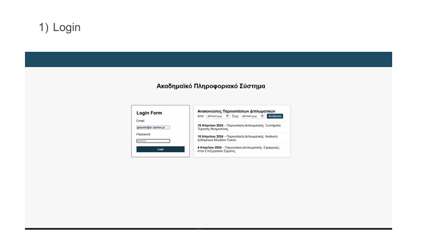

# web-project-2025

## Description
A full-stack web application developed as a university team project. This project demonstrates fundamental web development concepts, including frontend design, backend logic, and database interaction, by applying techniques learned in class.

## Features
- User Interface
- Backend logic for handling requests
- Database Integration
- Responsive Design

## Technologies
- HTML/CSS/JavaScript
- MySQL
- Git & GitHub

## Installation
Run using XAMPP server, VS Code, and by setting up the database!

## Screenshots
